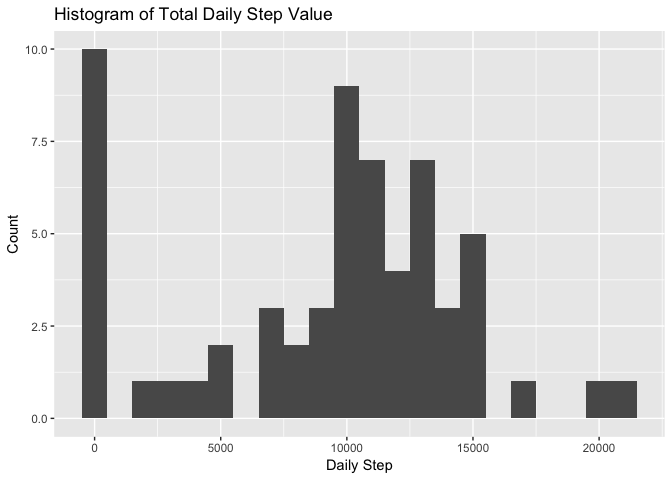
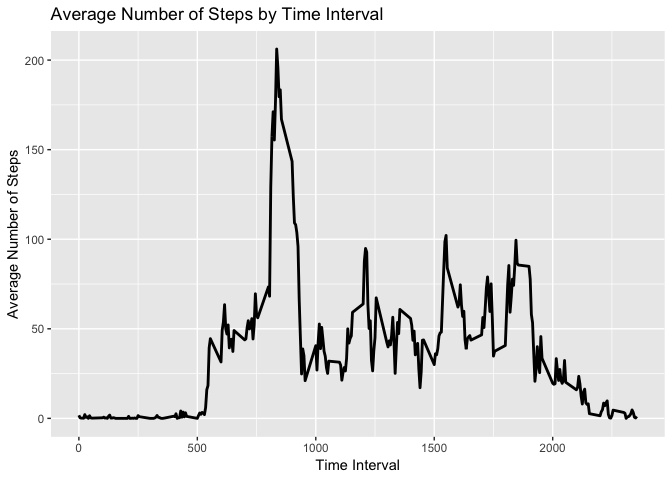
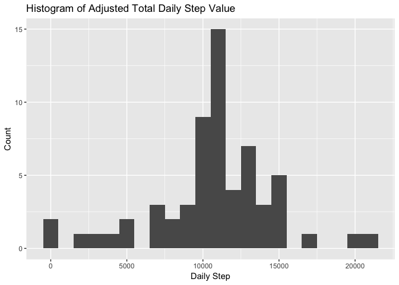
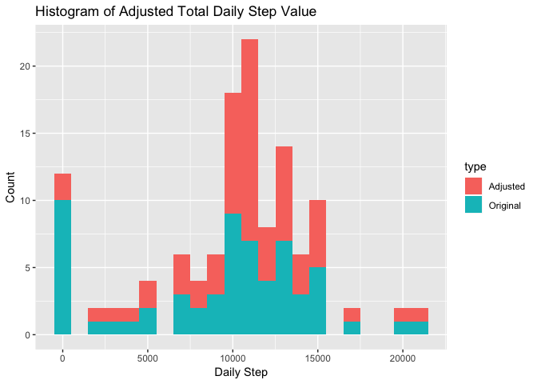
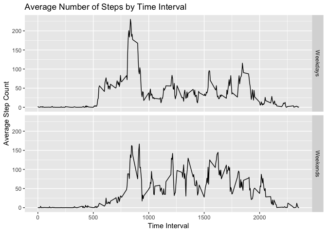
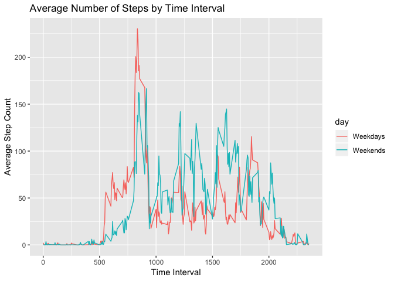

## Loading and preprocessing the data
The data used in this project could be download from [this link](https://d396qusza40orc.cloudfront.net/repdata%2Fdata%2Factivity.zip). The data is first downloaded to the local machine and unzipped using 'download.file' and 'unzip' respectively. 
 

```r
URL<-"https://d396qusza40orc.cloudfront.net/repdata%2Fdata%2Factivity.zip"
filename="activity.csv"
if (!file.exists(filename)) {
    download.file(url=URL, destfile = filename, method="curl")
    unzip(filename)
}
```
 
The data is loaded in R using the 'read.csv' command. 
 

```r
activity_data<-read.csv(filename)
```
 
In order to understand how the data like, the first 6 rows are shown below. 
 

```r
head(activity_data,n=6L)
```

```
##   steps       date interval
## 1    NA 2012-10-01        0
## 2    NA 2012-10-01        5
## 3    NA 2012-10-01       10
## 4    NA 2012-10-01       15
## 5    NA 2012-10-01       20
## 6    NA 2012-10-01       25
```

 

In this project, the 'ggplot2' package is used for all plotting purposes.

```r
library(ggplot2)
```

```
## Warning: package 'ggplot2' was built under R version 3.4.4
```

## What is mean total number of steps taken per day?
The mean number of steps taken per day is calculated using 'base' package. The 'daily total', 'mean', and 'median' values are reported below:
 

```r
daily_step <- with(activity_data,tapply(steps,date,sum,na.rm=TRUE ))
print(daily_step)
```

```
## 2012-10-01 2012-10-02 2012-10-03 2012-10-04 2012-10-05 2012-10-06 
##          0        126      11352      12116      13294      15420 
## 2012-10-07 2012-10-08 2012-10-09 2012-10-10 2012-10-11 2012-10-12 
##      11015          0      12811       9900      10304      17382 
## 2012-10-13 2012-10-14 2012-10-15 2012-10-16 2012-10-17 2012-10-18 
##      12426      15098      10139      15084      13452      10056 
## 2012-10-19 2012-10-20 2012-10-21 2012-10-22 2012-10-23 2012-10-24 
##      11829      10395       8821      13460       8918       8355 
## 2012-10-25 2012-10-26 2012-10-27 2012-10-28 2012-10-29 2012-10-30 
##       2492       6778      10119      11458       5018       9819 
## 2012-10-31 2012-11-01 2012-11-02 2012-11-03 2012-11-04 2012-11-05 
##      15414          0      10600      10571          0      10439 
## 2012-11-06 2012-11-07 2012-11-08 2012-11-09 2012-11-10 2012-11-11 
##       8334      12883       3219          0          0      12608 
## 2012-11-12 2012-11-13 2012-11-14 2012-11-15 2012-11-16 2012-11-17 
##      10765       7336          0         41       5441      14339 
## 2012-11-18 2012-11-19 2012-11-20 2012-11-21 2012-11-22 2012-11-23 
##      15110       8841       4472      12787      20427      21194 
## 2012-11-24 2012-11-25 2012-11-26 2012-11-27 2012-11-28 2012-11-29 
##      14478      11834      11162      13646      10183       7047 
## 2012-11-30 
##          0
```


```r
mean(daily_step)
```

```
## [1] 9354.23
```


```r
median(daily_step)
```

```
## [1] 10395
```

The histogram is plotted using the 'ggplot2' package. In order to do so, the daily_step is first transformed into a dataframe.


```r
daily_step<-data.frame(daily_step)
ggplot(daily_step, aes(daily_step)) +
    geom_histogram(binwidth=1000) +
    xlab("Daily Step") +
    ylab("Count") +
    ggtitle("Histogram of Total Daily Step Value")
```

<!-- -->

## What is the average daily activity pattern?
The average number of steps taken for each 5-minute interval averaged across all days is calculated using the 'base' package as below. 


```r
interval_step<-with(activity_data,tapply(steps,interval,mean, na.rm=TRUE))
interval_DF<-data.frame(interval=names(interval_step),step=interval_step)
interval_DF$interval<-as.numeric(as.character(interval_DF$interval))
```

The daily activity pattern is plotted using the 'ggplot2' package:

```r
ggplot(interval_DF,aes(interval,step))+
    geom_line(lwd=1) +
    xlab("Time Interval") +
    ylab("Average Number of Steps") +
    ggtitle("Average Number of Steps by Time Interval")
```

<!-- -->

The maximum average number of steps could be found using the 'max' command.

```r
max(interval_step)
```

```
## [1] 206.1698
```

## Imputing missing values
The total number of missing values in the data set could be calculated:

```r
sum(is.na(activity_data$steps))
```

```
## [1] 2304
```
The missing values in the data set are filled in using average number of steps over the time interval.


```r
match_interval<-match(activity_data$interval,interval_DF$interval)
data_mean<-interval_DF$step[match_interval]
NA_index<-is.na(activity_data$steps)
filled_data<-activity_data
filled_data$steps[NA_index]<-data_mean[NA_index]
```
 
The first 6 rows of the filled data set is shown below to illustrate that the NA values have been filled: 


```r
head(filled_data,n=6L)
```

```
##       steps       date interval
## 1 1.7169811 2012-10-01        0
## 2 0.3396226 2012-10-01        5
## 3 0.1320755 2012-10-01       10
## 4 0.1509434 2012-10-01       15
## 5 0.0754717 2012-10-01       20
## 6 2.0943396 2012-10-01       25
```

The adjusted histogram, mean value and median value are re-computed:


```r
daily_adjust <- with(filled_data,tapply(steps,date,sum,na.rm=TRUE ))
mean(daily_adjust)
```

```
## [1] 10766.19
```


```r
median(daily_adjust)
```

```
## [1] 10766.19
```


```r
daily_adjust<-data.frame(daily_step=daily_adjust)
ggplot(daily_adjust, aes(daily_step)) +
    geom_histogram(binwidth=1000) +
    xlab("Daily Step") +
    ylab("Count") +
    ggtitle("Histogram of Adjusted Total Daily Step Value")
```

<!-- -->

As the missing values are removed in plotting the histogram of the original data set, it is expected the adjusted histogram is shifted to the right on the same plot. This can be illusted by plotting the two histograms on the same figure. 


```r
daily_step$type<-"Original"
daily_adjust$type<-"Adjusted"
daily_combine<-rbind(daily_step,daily_adjust)

ggplot(daily_combine,aes(daily_step, fill=type))+
    geom_histogram(binwidth = 1000)+
    xlab("Daily Step") +
    ylab("Count") +
    ggtitle("Histogram of Adjusted Total Daily Step Value")
```

<!-- -->
It could be observed that the counts at the middle of the histogram are significantly higher in the adjusted data set as compared to that in the original data set. At the same time, the count at 0 is significant less in the adjusted data set. 

## Are there differences in activity patterns between weekdays and weekends?
The filled data is used to identify the difference in activity patterns between weekdays and weekends. The days of the week are first identified using 'as.Date' and 'weekdays' functions. 'grep' is then used to assigned 'weekdays' or 'weekends' to the respective dates.

```r
filled_data$date<-as.character(weekdays(as.Date(filled_data$date)))
```

```
## Warning in strptime(xx, f <- "%Y-%m-%d", tz = "GMT"): unknown timezone
## 'default/Asia/Ho_Chi_Minh'
```

```r
filled_data$date[grepl("[S](at|un)",filled_data$date)]<-"Weekends"
filled_data$date[!grepl("Weekends",filled_data$date)]<-"Weekdays"
```
The average number of steps in each interval is calculated over 'weekdays' and 'weekends' separately.


```r
day_step<-with(filled_data,aggregate(steps, by=list(interval,date),FUN=mean))
names(day_step)<-c("interval","day","step")
```
The average numbers of steps are plotted again time interval for 'weekend' and 'weekday' separately. 

```r
ggplot(day_step,aes(interval,step))+
    facet_grid(day~.)+
    geom_line()+
    xlab("Time Interval") +
    ylab("Average Step Count") +
    ggtitle("Average Number of Steps by Time Interval")
```

<!-- -->

For comparison purpose, the two plots are drawn on the same figure as below:


```r
ggplot(day_step,aes(interval,step,color=day))+
    geom_line()+
    xlab("Time Interval") +
    ylab("Average Step Count") +
    ggtitle("Average Number of Steps by Time Interval")
```

<!-- -->

From the combined graph, it could be observed that there is a difference in activity pattern on 'Weekdays' and 'Weekends'. The comparison is done by splitting the time interval into four different range: 

### Time Interval from 0 to 500:
During this interval, both 'Weekdays' and 'Weekend' show minimal activity with the average step counts at 0. 
 
### Time Interval from 500 to 900:
Even though both the average step counts increase during this interval in both 'Weekdays' and 'Weekends' samples, the step count on 'Weekdays' is significantly larger than that on 'Weekends'.
 
### Time Interval from 900 to 2100:
This interval indicates that the step counts on 'Weekends' are generally higher than that on 'Weekdays', with exception observed at approximately 1800-1900 time interval. 

### Time Interval from 2100 to 2355:
The step counts on both 'Weekdays' and 'Weekends' drop rapidly to almost 0. 
